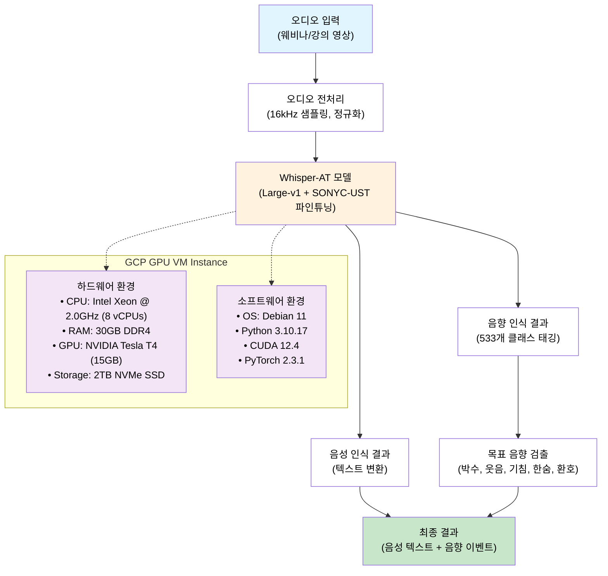

# TC1(음성 외 음향 인식률) 시험 환경 구성도

## 시스템 구성 개요

TC1 시험은 Whisper-AT 모델을 기반으로 한 음성 인식과 음향 이벤트 동시 감지 시스템으로 구성됩니다.

## 구성도

## 구성 요소 설명

### 1. 입력 단계
- **오디오 입력**: 웨비나 및 강의 영상에서 추출한 오디오 데이터
- **전처리**: 16kHz 샘플링 레이트로 정규화 및 포맷 변환

### 2. 핵심 모델
- **Whisper-AT 모델**: 
  - 기본: Whisper Large-v1 아키텍처
  - 확장: SONYC-UST 데이터셋으로 파인튜닝
  - 클래스: 기존 527개 + 신규 6개 = 총 533개 클래스

### 3. 출력 단계
- **음성 인식**: 발화 내용을 텍스트로 변환
- **음향 인식**: 533개 음향 클래스 중 해당 이벤트 태깅
- **목표 음향**: 5가지 주요 음향 (박수, 웃음, 기침, 한숨, 환호) 검출

### 4. 실행 환경
- **클라우드**: Google Cloud Platform (GCP) GPU VM Instance
- **하드웨어**: NVIDIA Tesla T4 GPU, Intel Xeon CPU, 29GB RAM
- **소프트웨어**: Debian 11, Python 3.10, CUDA 12.4, PyTorch 2.3

## 평가 기준
- **음성 인식률**: 기존 Whisper 수준 유지 (저하 없음)
- **음향 인식률**: 5가지 목표 음향 100% 인식
- **테스트 환경**: 30dB SNR 조건의 실제 웨비나/강의 영상 10개

## 기술적 특징
1. **동시 처리**: 음성 인식과 음향 감지를 하나의 모델로 처리
2. **확장성**: 533개 음향 클래스 지원으로 다양한 환경 대응
3. **강인성**: SONYC-UST 파인튜닝으로 도시 소음 환경 적응력 향상
4. **실용성**: 실제 웨비나/강의 환경에서 검증된 성능 