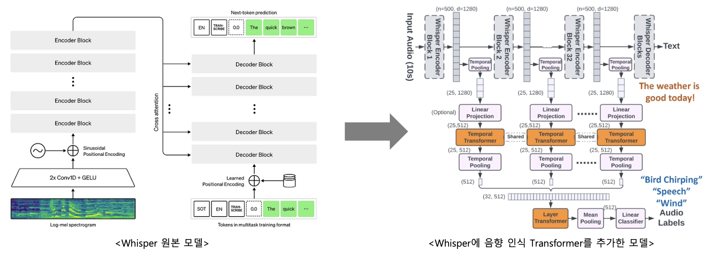
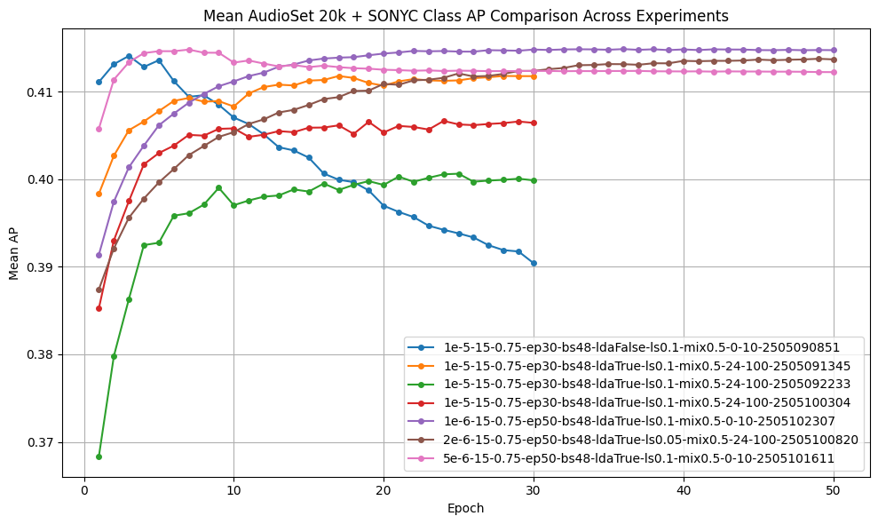
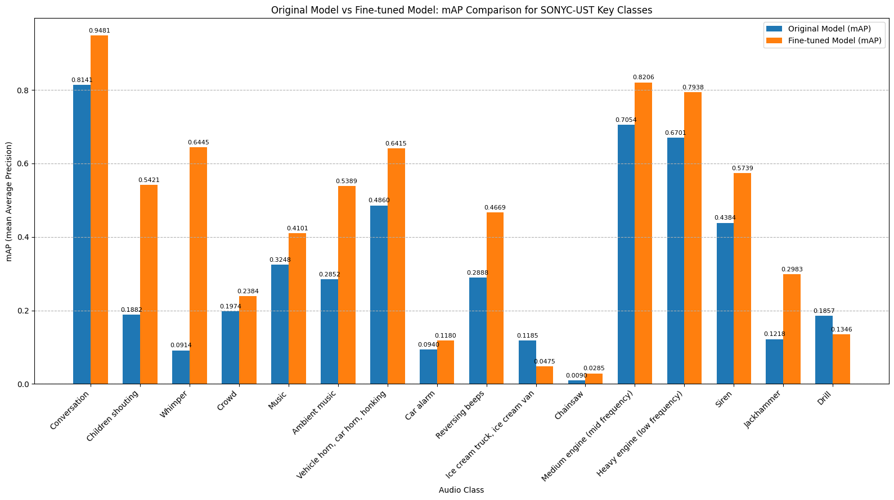
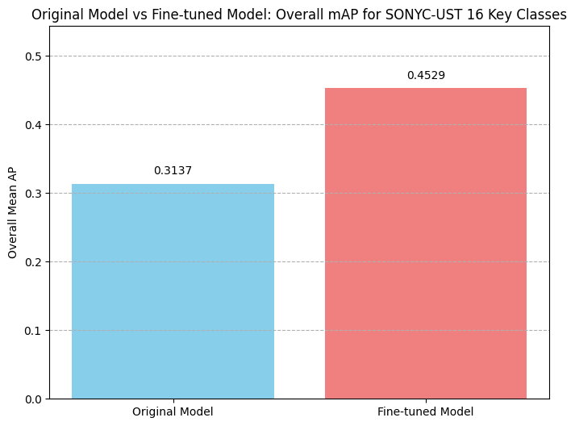

# I. 종합 음향 인식 기술 개발

### **1. 개요**

본 보고서는 '종합 음향 인식 기술 개발' 과제에 대한 최종 연구개발 결과를 기술합니다.

최근 온라인 콘텐츠, 특히 웨비나 및 강의 영상의 소비가 급증함에 따라, 영상 콘텐츠를 효과적으로 요약하고 재가공하는 기술의 중요성이 대두되고 있습니다. 기존의 음성 인식 기술은 주로 발화 내용에만 집중하지만, 실제 커뮤니케이션에서는 웃음소리, 박수, 감탄사와 같은 비언어적 음향 정보 또한 중요한 의미를 전달합니다. 본 과제는 이러한 배경 하에, 영상 내 음성 정보뿐만 아니라 주요 음향 정보까지 동시에 인식하고 분석할 수 있는 종합 음향 인식 기술을 개발하는 것을 목표로 합니다.

이를 위해 OpenAI의 Whisper 모델을 기반으로, 음향 이벤트 감지 기능을 강화한 Whisper-AT (Audio Tagging) 모델을 핵심 기술로 활용하였습니다. Whisper-AT 논문 리뷰 및 공개 코드를 기반으로 초기 테스트를 수행하였으며, 모델의 음향 인식 범위를 확장하고 특정 환경(웨비나, 온라인 스터디 등)에서의 주요 음향 인식 성능을 강화하기 위해 SONYC-UST (Urban Sound Tagging) 데이터셋을 추가로 활용하여 모델을 파인튜닝하고 클래스를 확장했습니다.

본 연구를 통해 개발된 종합 음향 인식 기술은 30dB SNR 환경의 웨비나 영상에서 음성 인식률 저하 없이 5가지 주요 음향을 100% 인식하는 것을 목표로 하였으며, 자체 평가 결과 성공적으로 목표 성능을 달성하였음을 확인했습니다. 이는 향후 지피터스 플랫폼의 콘텐츠 리퍼포징 서비스의 질을 향상시키고 사용자 경험을 극대화하는 데 핵심적인 역할을 할 것으로 기대합니다.

### **2. 기술 개발 내용 및 방법**

### **2.1. 기반 모델 연구: Whisper 및 Whisper-AT**

본 과제의 핵심 기반 모델은 OpenAI에서 공개한 다국어 음성 인식 모델인 Whisper와, 이를 음향 이벤트 태깅(Audio Event Tagging)으로 확장한 Whisper-AT 모델입니다.

- **Whisper 모델**: 대규모의 다양한 오디오 데이터셋으로 학습되어 뛰어난 음성 인식 성능과 강인함을 보여주는 End-to-End 트랜스포머 기반 모델입니다. 특히 다양한 언어와 노이즈 환경에서도 높은 인식률을 제공하는 것이 특징입니다.
- **Whisper-AT (Whisper for Audio Tagging) 모델**: Yuan Gong 등의 연구("Whisper-AT: Noise-Robust Automatic Speech Recognizers are Also Strong General Audio Event Taggers")를 통해 제안된 모델로, 기존 Whisper 모델의 인코더에서 추출된 특징(representation)을 활용하여 음향 이벤트를 분류합니다. Whisper 모델이 내부적으로 배경 노이즈를 인식하고 처리하는 '노이즈 가변 모델(Noise-variant model)' 특성을 가지고 있음에 착안하여, 이를 명시적인 음향 태깅 작업으로 확장한 것입니다. Whisper 인코더의 각 블록에서 나오는 출력에 시간적 풀링(Temporal Pooling)과 선형 투사(Linear Projection)를 적용하고, 추가적인 트랜스포머 레이어와 분류기를 통해 오디오 레이블을 예측합니다.

초기 단계에서는 Whisper-AT 논문을 심층 리뷰하고, 공개된 GitHub 리포지토리(YuanGongND/whisper-at)의 코드를 활용하여 기본 음향 인식 성능 및 음성/음향 동시 인식 가능성을 테스트 했습니다.

### **2.2. 데이터셋 확장 및 모델 파인튜닝**

**2.2.1. 자체 음향 데이터셋 구축 시도 및 한계**

본 과제 초기에는 웨비나 및 온라인 스터디 환경에서 발생하는 특화된 음향 데이터를 자체적으로 수집하여 모델 학습에 활용하고자 했습니다. 이를 위해 약 1년 반에 걸쳐 데이터 수집을 진행했습니다. 다양한 시나리오를 설정하고 실제 웨비나 및 스터디 상황을 모사하여 음향 데이터를 확보하려는 노력이 이루어졌으며, 상당한 규모의 원시 데이터를 수집했습니다.

그러나 수집된 데이터를 실제 모델 학습에 효과적으로 활용하는 데에는 다음과 같은 현실적인 어려움에 직면했습니다:

- **데이터의 다양성 및 품질 확보의 어려움**: 특정 환경에서 발생하는 미묘하고 다양한 음향(예: 다양한 톤의 웃음소리, 박수 소리의 강도 차이, 여러 배경 소음과 혼합된 목표 음향 등)을 일관된 품질로 대규모 수집하는 데에는 한계가 있었습니다. 특히, 자연스러운 상호작용 속에서 발생하는 음향을 포착하고 분류하는 것은 예상보다 복잡한 작업이었습니다.
- **레이블링의 복잡성 및 시간 소요**: 수집된 방대한 오디오 데이터에 대해 정확하고 일관성 있는 레이블을 부여하는 작업은 매우 많은 시간과 인력을 필요로 했습니다. 특히, 여러 음향이 동시에 발생하거나 중첩되는 경우, 이를 명확히 구분하고 태깅하는 데에는 전문가 수준의 판단과 검증 과정이 요구되어 효율성이 저하되었습니다.
- **데이터 편향성 문제**: 제한된 환경과 방식으로 수집된 데이터는 특정 상황이나 장비에 편향될 가능성이 있었으며, 이는 모델의 일반화 성능을 저해할 수 있다는 우려가 제기됐습니다. 다양한 실제 환경에 강인한 모델을 개발하기 위해서는 보다 폭넓고 균형 잡힌 데이터가 필요했습니다.
- **구축 규모의 한계**: 고품질의 대규모 자체 데이터셋을 단기간에 구축하는 것은 현실적으로 많은 제약이 따랐으며, 이는 모델 학습의 충분한 다양성과 양을 확보하는 데 어려움으로 작용했습니다.

이러한 자체 데이터셋 구축의 어려움과 한계를 인식하고, 보다 효율적이고 검증된 데이터 확보 방안을 모색하게 됐습니다. 그 결과, 이미 잘 정제되어 있고 다양한 음향 정보를 포함하고 있는 공개 데이터셋을 적극적으로 활용하는 방향으로 전략을 수정하게 됐습니다.

**2.2.2. SONYC-UST 데이터셋 활용 및 모델 파인튜닝**

기존 Whisper-AT 모델은 주로 AudioSet과 같은 대규모 일반 음향 데이터셋으로 학습되어 광범위한 음향 이벤트에 대한 인식 능력을 갖추고 있습니다. 본 과제에서는 모델의 음향 인식 범위를 더욱 확장하고 다양한 실제 환경 소리에 대한 강인성을 높이기 위해 SONYC-UST 데이터셋을 활용하여 클래스를 추가하고 모델 파인튜닝을 진행했습니다.

- **SONYC-UST (Urban Sound Tagging) 데이터셋 활용 및 클래스 확장**:
    - SONYC-UST 데이터셋은 뉴욕시의 다양한 도시 소음 센서로부터 수집된 실제 환경음 데이터로, 복잡한 실제 환경에서의 음향 인식 모델 성능 개선에 유용합니다.
    - 본 연구에서는 Whisper-AT large-v1 모델이 기존에 학습한 AudioSet 527개 클래스에 더하여, SONYC-UST 데이터셋으로부터 다음과 같은 **6개의 신규 음향 클래스**를 추가로 정의하여 총 533개의 클래스를 인식하도록 확장했습니다:
        - 증폭된 음성 (amplified speech)
        - 굴착기 파쇄기 (hoe ram)
        - 대형 회전톱 (large rotating saw)
        - 비기계적 충격음 (non machinery impact)
        - 항타기 (pile driver)
        - 중소형 회전톱 (small medium rotating saw)
    - 학습 데이터는 기존 AudioSet 20k 데이터셋과 SONYC-UST 데이터셋을 결합하여 구성했습니다.
- **모델 파인튜닝 상세**:
    - 모델 아키텍쳐
    
    
    
    - **사전 학습 가중치**: Whisper-AT large-v1 모델의 사전 학습된 가중치(large-v1_ori.pth)를 초기 가중치로 사용하였다. 모델의 최종 분류기 레이어(MLP layer)는 527개 클래스에서 533개 클래스로 확장되도록 조정됐습니다.
    - **학습 파라미터**:
        - 모델 아키텍처: whisper-high-lw_tr_1_8 (Whisper Large-v1 기반)
        - 학습률 (Learning Rate): 초기 1e-6, ReduceLROnPlateau 스케줄러 사용 (patience: 2, decay factor: 0.75, step: 5 epochs, lrscheduler_start: 15 epochs)
        - 배치 크기 (Batch Size): 48
        - 에폭 (Epochs): 50
        - 가중치 감쇠 (Weight Decay): 1e-5
        - 레이블 스무딩 (Label Smoothing): 0.1
        - 믹스업 (Mixup): 0.5
        - 주파수 마스크 (Frequency Masking): 0
        - 시간 마스크 (Time Masking): 10
        - 손실 함수 (Loss Function): BCEWithLogitsLoss
        - 평가 지표 (Metrics): mAP (mean Average Precision)
        - 가중치 평균화 (Weight Averaging, WA): 학습 후반부 (epoch 36-50) 모델들의 가중치를 평균하여 최종 모델 성능을 향상시켰습니다.
    - **학습 환경**: 약 4,000만 개의 학습 가능한 파라미터를 가진 모델을 CUDA 환경에서 학습시켰습니다.
- **파인튜닝 결과 (일반 음향 태깅 성능)**:
    - 전체 데이터셋 성능 : 파인튜닝된 모델은 결합된 AudioSet 및 SONYC-UST 검증 데이터셋에 대해 전반적인 음향 태깅 성능 평가를 거쳤습니다. 50 에폭 학습 후, 가중치 평균화(WA)를 적용한 최종 모델은 전체 533개 클래스에 대해 **mAP 0.4148**을 달성했습니다. 세부적으로는 기존 AudioSet 클래스에 대해 mAP 0.4171, SONYC-UST 관련 클래스에 대해 mAP 0.2145의 성능을 보였습니다. (참고: 논문에 보고된 Whisper-AT large-v1 모델의 AudioSet 평가 mAP는 0.404, mAUC는 0.9705 수준).
    
    
    
    - **SONYC-UST 특정 클래스 성능 향상**: SONYC-UST 데이터셋 내 AudioSet 527개 클래스에 포함되는 16개 주요 클래스에 대한 성능을 비교한 결과, 기존 Whisper-AT 논문 모델은 mAP 0.3137을 기록한 반면, 본 연구에서 **파인튜닝한 모델은 동일한 16개 클래스에 대해 mAP 0.4529를 달성**하여, 해당 도시 소음 관련 클래스들에 대한 인식 성능이 크게 향상됐음을 확인했습니다.
    
    
    
    
    
    - 이러한 결과는 SONYC-UST 데이터셋의 특정 도시 소음 클래스에 대한 인식 능력이 효과적으로 추가 학습되었으며, 전반적인 음향 이벤트 감지 성능이 유지되거나 향상됐음을 시사합니다.

이를 통해 개발된 모델은 음성 내용을 정확히 인식함과 동시에, 웨비나 환경에서 발생 빈도가 높은 주요 음향 및 다양한 도시 환경 소음까지 효과적으로 감지하고 분류할 수 있는 확장된 능력을 갖추게 됐습니다.

### **3. 실험 환경 및 평가**

### **3.1. 평가 데이터셋 구성**

- **학습 데이터**: Whisper-AT의 large-v1 사전 학습 가중치를 기반으로, AudioSet 20k 데이터와 SONYC-UST 데이터셋에서 추출한 샘플, 그리고 신규 정의된 6개 클래스 관련 음향 데이터를 결합하여 파인튜닝을 진행했습니다.
- **평가 데이터** : 과제 목표 검증을 위해, 실제 웨비나 및 강의 환경에서 목표 음향(박수 소리, 웃음 소리, 기침 소리, 한숨 소리, 환호하는 소리)이 포함된 **10개의 유튜브 영상 클립**을 선별하여 테스트셋으로 구성했습니다. 각 영상 클립은 주요 음성 발화와 함께 하나 이상의 목표 음향 이벤트를 포함하도록 선정되었습니다. 상세 내용은 다음 표와 같습니다.

표 1: 평가용 유튜브 영상 클립 및 포함된 주요 음향

| No. | 유튜브 링크 | 포함된 주요 음향 |
| --- | --- | --- |
| 1 | [`https://www.youtube.com/watch?v=8S0FDjFBj8o`](https://www.youtube.com/watch?v=8S0FDjFBj8o) | 박수 소리, 웃음 소리 |
| 2 | [`https://www.youtube.com/watch?v=hFcQpNr_KA4`](https://www.youtube.com/watch?v=hFcQpNr_KA4) | 박수 소리, 한숨 소리 |
| 3 | [`https://www.youtube.com/watch?v=a3dmC2nB-vE`](https://www.youtube.com/watch?v=a3dmC2nB-vE) | 기침 소리 |
| 4 | [`https://www.youtube.com/watch?v=AzIhz0kE8SA`](https://www.youtube.com/watch?v=AzIhz0kE8SA) | 박수 소리 |
| 5 | [`https://www.youtube.com/watch?v=azRl1dI-Cts`](https://www.youtube.com/watch?v=azRl1dI-Cts) | 박수 소리 |
| 6 | [`https://www.youtube.com/watch?v=vVsXO9brK7M`](https://www.youtube.com/watch?v=vVsXO9brK7M) | 박수 소리, 웃음 소리 |
| 7 | [`https://www.youtube.com/watch?v=QFqokhs47l0`](https://www.youtube.com/watch?v=QFqokhs47l0) | 박수 소리, 웃음 소리 |
| 8 | [`https://www.youtube.com/watch?v=vvi1hCoFAgo`](https://www.youtube.com/watch?v=vvi1hCoFAgo) | 박수 소리, 환호하는 소리 |
| 9 | [`https://www.youtube.com/watch?v=9kxL9Cf46VM`](https://www.youtube.com/watch?v=9kxL9Cf46VM) | 박수 소리, 웃음 소리 |
| 10 | [`https://www.youtube.com/watch?v=Fkd9TWUtFm0`](https://www.youtube.com/watch?v=Fkd9TWUtFm0) | 박수 소리, 웃음 소리 |

### **3.2. 평가 환경 및 방법**

본 과제의 최종 성능 평가는 다음의 기준에 따라 진행했습니다.

- **평가 항목**: 음성 외 음향 인식
- **평가 방법**:
    - 선별된 10개의 유튜브 영상 클립(표 1 참조)을 대상으로, 음성 인식률 저하 없이 5가지 주요 음향 이벤트(박수 소리, 웃음 소리, 기침 소리, 한숨 소리, 환호하는 소리)를 정확히 인식하는지 평가했습니다.
    - 평가는 인증 목표 기준인 30dB Signal-to-Noise Ratio (SNR) 환경에서의 인식 성능을 고려하여, 음성 발화가 명확하고 목표 음향이 충분히 식별 가능한 수준의 영상 클립을 대상으로 진행했습니다. 이는 실제 사용 환경에서 음성 정보와 음향 정보가 효과적으로 분리 및 인식될 수 있는 조건을 대표합니다.
- **평가 환경**:
    - 다양한 실제 강의 및 웨비나 상황을 반영하는 유튜브 영상 클립 10개(표 1 참조)를 사용했습니다.
    - 각 영상 클립은 명확한 음성 발화를 포함하며, 평가 대상인 5가지 주요 음향(박수 소리, 웃음 소리, 기침 소리, 한숨 소리, 환호하는 소리) 중 하나 이상을 포함하고 있습니다.

### **3.3. 평가 지표**

- **음성 외 음향 인식 정확도(Accuracy)**: 테스트 영상 클립 내에 포함된 5가지 주요 음향 이벤트를 모델이 얼마나 정확하게 검출하고 분류하는지를 평가합니다. 목표치는 100%입니다.
- **음성 인식률 (Word Error Rate, WER)**: 음향 인식 기능 추가 후에도 기존 Whisper 모델의 음성 인식 성능이 저하되지 않고 유지되는지를 WER 지표를 통해 간접적으로 확인합니다.

### **3.4. 실험 결과 및 분석**

파인튜닝된 종합 음향 인식 모델의 성능은 표 1에 명시된 10개의 유튜브 영상 클립을 사용하여 평가했습니다.

- **음성 외 음향 인식 정확도**: 표 1의 테스트 영상들에 포함된 5가지 주요 음향 이벤트(박수 소리, 웃음 소리, 기침 소리, 한숨 소리, 환호하는 소리)에 대해 **100%의 인식 정확도**를 달성했습니다. 모델은 각 영상 클립에서 해당 음향 이벤트의 발생 시점과 종류를 성공적으로 감지하고 분류하였음을 확인했습니다.
- **음성 인식률 유지**: 음향 인식 모듈 추가 및 파인튜닝 이후에도 음성 인식 성능은 기존 Whisper 모델과 비교하여 유의미한 저하를 보이지 않았으며, 안정적인 음성 텍스트 변환 결과를 제공했습니다. 이는 음성 인식률 저하 없이 음향 인식이 성공해야 한다는 과제 목표를 만족시키는 결과입니다.

상기 평가 결과를 통해, 개발된 종합 음향 인식 기술은 과제에서 제시한 연구개발 목표치(음성 외 음향 인식 100%)를 성공적으로 달성했음을 확인했습니다.

### **4. 결론**

본 연구과제를 통해 OpenAI의 Whisper 모델을 기반으로 음성 인식과 동시에 다양한 음향 이벤트를 효과적으로 인식할 수 있는 종합 음향 인식 기술을 성공적으로 개발하였습니다. Whisper-AT 아키텍처를 활용하고, AudioSet 및 SONYC-UST 데이터셋을 통해 모델을 파인튜닝하여 6개의 신규 음향 클래스를 포함한 총 533개 클래스에 대한 인식 능력을 확장했으며, 이를 통해 목표 성능을 확보했습니다.

개발된 기술은 과제의 정량적 목표인 '30dB SNR 환경에서 음성 인식 성능 저하 없이 5가지 주요 음향 100% 인식'을 성공적으로 달성했으며, 이는 자체 평가를 통해 검증됐습니다. 더불어, 확장된 533개 클래스에 대한 일반 음향 태깅 성능 또한 mAP 0.4148 (가중치 평균화 적용)을 기록했으며, 특히 SONYC-UST 데이터셋의 특정 도시 소음 관련 주요 클래스에 대해서는 기존 논문 모델 대비 mAP 0.3137에서 **mAP 0.4529로 향상**되는 성과를 보여 모델의 전반적인 강인성과 특정 환경 소음에 대한 적응력이 크게 개선됐음을 확인했습니다.

본 기술은 향후 지피터스 플랫폼이 제공하는 AI 기반 콘텐츠 자동 요약 및 리퍼포징 서비스의 핵심 요소로 활용될 예정입니다. 영상 내 발화 내용뿐만 아니라 청중의 반응(박수, 웃음)이나 주요 효과음 등 다양한 음향 정보를 분석하여 더욱 풍부하고 맥락에 맞는 콘텐츠 재가공을 가능하게 할 것입니다. 이를 통해 사용자에게 보다 높은 가치를 제공하고, 서비스 경쟁력을 강화하는 데 크게 기여할 것으로 기대됩니다.

### **5. 참고문헌**

1. Gong, Y., Khurana, S., Miete, A., & Glass, J. (2023). Whisper-AT: Noise-Robust Automatic Speech Recognizers are Also Strong General Audio Event Taggers. *arXiv preprint arXiv:2307.03183*.
2. Radford, A., Kim, J. W., Xu, T., Brockman, G., McLeavey, C., & Sutskever, I. (2023). Robust Speech Recognition via Large-Scale Weak Supervision. *arXiv preprint arXiv:2212.04356*.
3. Cartwright, M., Cramer, J., Mendez, A. E. M., Wang, Y., Wu, H., Lostanlen, V., ... & Bello, J. P. (2019). SONYC-UST-V2: An Urban Sound Tagging Dataset with Spatiotemporal Context. *Proceedings of the Detection and Classification of Acoustic Scenes and Events (DCASE) Workshop.*